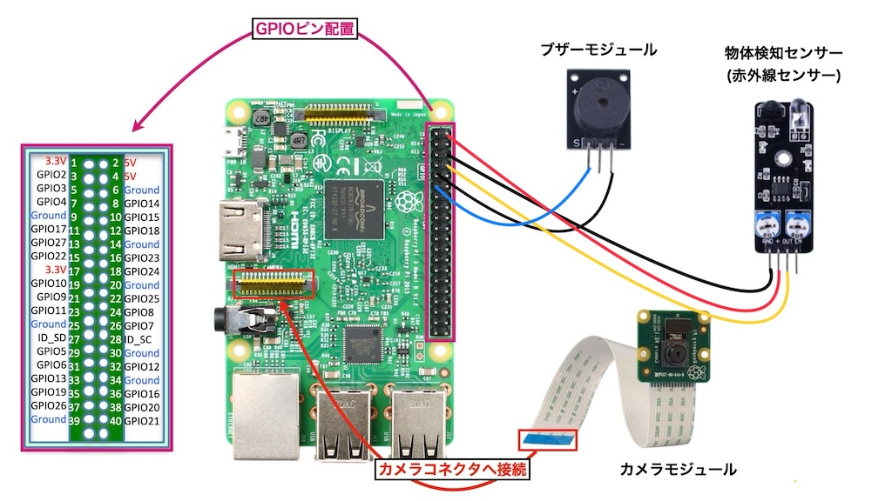

# TheftPreventionSystem

赤外線障害物検知センサーで物体を監視し、物体が存在しなくなったら(=盗まれたら)ブザーを鳴らし警告、カメラ撮影を行うシステムです。

## Sensor/Module

- 物体検知センサー(赤外線センサー)
- アクティブブザーモジュール
- RaspberryPi カメラモジュール

## Wiring Diagram



**■ 物体検知センサー(赤外線センサー)**  
GND -- ラズパイ (GND)  
VCC (＋) -- ラズパイ (5V)  
OUT -- ラズパイ (GPIO14)

**■ ブザーモジュール**  
GND -- ラズパイ (GND)  
S (Signal) -- ラズパイ (GPIO17)

**■ カメラモジュール**  
ラズパイのコネクタに直接接続

## Setup

```bash
pip3 install -r requirements.txt
```

## RUN

```bash
python3 main.py
```
